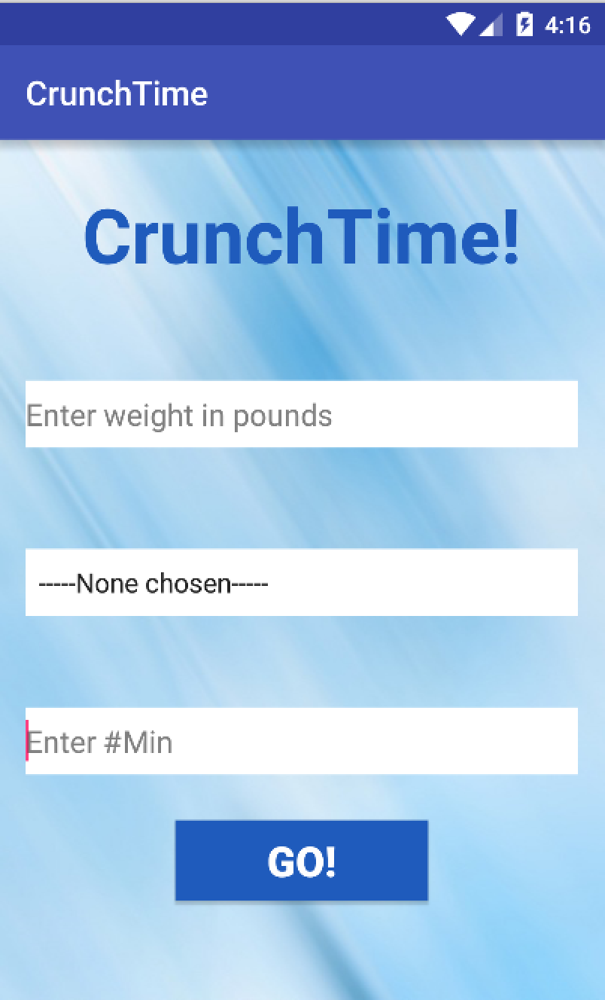

# PROG 01: Crunch Time

Briefly describe your app here.

## Authors

Aparna Narayan ([anarayan@berkeley.edu](mailto:anarayan@berkeley.edu))

## Demo Video

See [CS160Prog01] (https://www.youtube.com/watch?v=sYf2JBCFrAw&feature=youtu.be)

## Screenshots

## Acknowledgments

* Hat tip to anyone who's code was used
* Any other support

*Feel free to enhance your README. For Markdown syntax, see [the GitHub Guides](https://guides.github.com/features/mastering-markdown/). Remove this line in your submission.*
